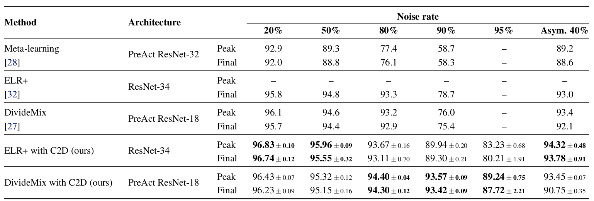
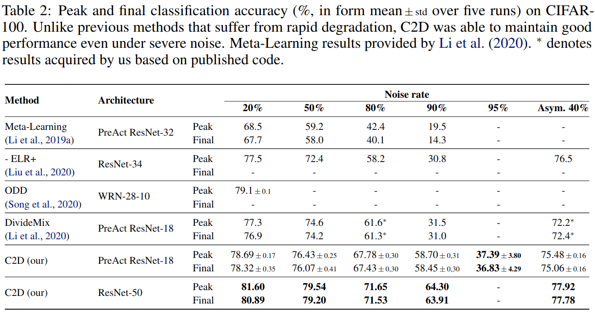
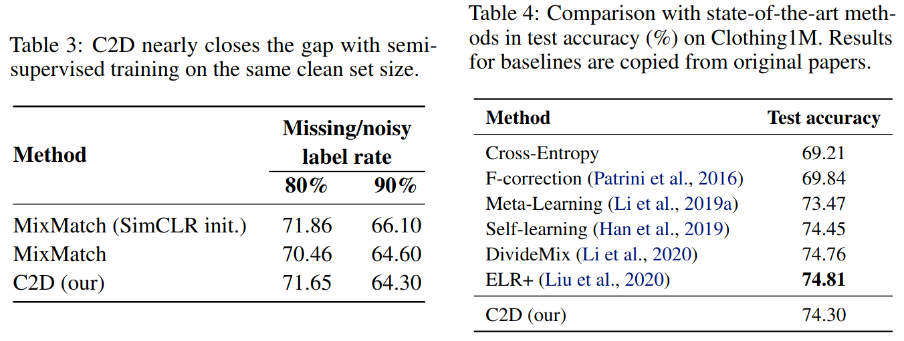

# Contrast to Divide: self-supervised pre-training for learning with noisy labels
This is an official implementation of 
["Contrast to Divide: self-supervised pre-training for learning with noisy labels"](https://openreview.net/forum?id=uB5x7Y2qsFR).
The code is based on [DivideMix](https://github.com/LiJunnan1992/DivideMix) implementation.

## Results
Following tables summarize main resutls of the paper:

CIFAR-10:


CIFAR-100:


Clothing1M:


mini-WebVision:

## Running the code

First you need to install dependencies by running `pip install -r requirements.txt`.

You can download pretrained self-supervised models from 
[Google Drive](https://drive.google.com/drive/folders/1qYVdggtNFQZBZ-OqVJm80LBKUKpdLPUm?usp=sharing). 
Alternatively, you can train them by yourself, using [SimCLR implementation](https://github.com/HobbitLong/SupContrast).
Put them into `./pretrained` folder.

Then you can run the code for CIFAR
```
python3 main_cifar.py --r 0.8 --lambda_u 500 --dataset cifar100 --p_threshold 0.03 --data_path ./cifar-100 --experiment-name simclr_resnet18 --method selfsup --net resnet50
```
for Clothing1M
```
python3 main_clothing1M.py --data_path /path/to/clothing1m --experiment-name selfsup --method selfsup --p_threshold 0.7 --warmup 5 --num_epochs 120
```
or for mini-WebVision
```
python3 Train_webvision.py --p_threshold 0.03 --num_class 50 --data_path /path/to/webvision --imagenet_data_path /path/to/imagenet --method selfsup```
```

To run C2D with ELR+ just use the self-suprevised pretrained models with the original [code](https://github.com/shengliu66/ELR/).
## License
This project is licensed under the terms of the MIT license.
