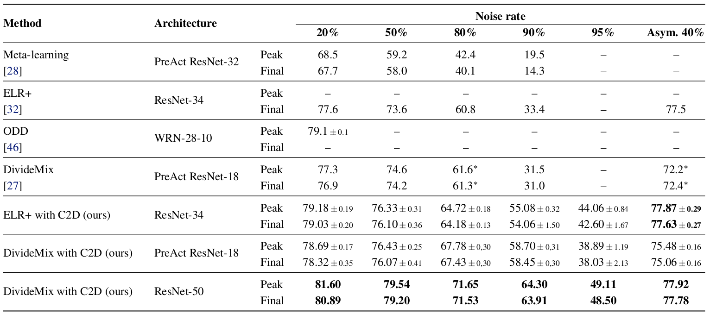
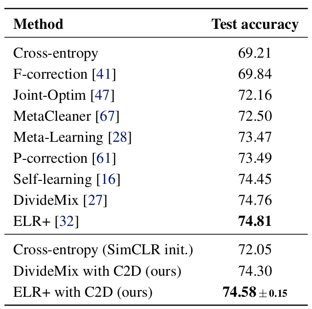

# Contrast to Divide: self-supervised pre-training for learning with noisy labels
This is an official implementation of 
["Contrast to Divide: self-supervised pre-training for learning with noisy labels"](https://openreview.net/forum?id=uB5x7Y2qsFR).
The code is heavily based on [DivideMix](https://github.com/LiJunnan1992/DivideMix)

## Results
Following tables summarize main resutls of the paper:





## Running the code

First you need to install dependencies by running `pip install -r requirements.txt`.

You can download pretrained self-supervised models from 
[Google Drive](https://drive.google.com/drive/folders/1qYVdggtNFQZBZ-OqVJm80LBKUKpdLPUm?usp=sharing). 
Alternatively, you can train them by yourself, using [SimCLR implementation](https://github.com/HobbitLong/SupContrast).

Then you can run the code for CIFAR
```
python3 main_cifar.py --r 0.8 --lambda_u 500 --dataset cifar100 --p_threshold 0.03 --data_path ./cifar-100 --experiment-name simclr_resnet18 --method selfsup --net resnet50
```
or for Clothing1M
```
python3 main_clothing1M.py --data_path ~/Clothing-1M/images --experiment-name selfsup --method selfsup --p_threshold 0.7 --warmup 5 --num_epochs 120
```

## Citing C2D
If you found C2D useful please cite us. You can use the following bibtex:
```
@article{
anonymous2021c2d,
title={Contrast to Divide: self-supervised pre-training for learning with noisy labels},
author={Anonymous},
booktitle={Submitted to International Conference on Learning Representations},
year={2021},
url={https://openreview.net/forum?id=uB5x7Y2qsFR},
note={under review}
}
```

## License
This project is licensed under the terms of the MIT license.
